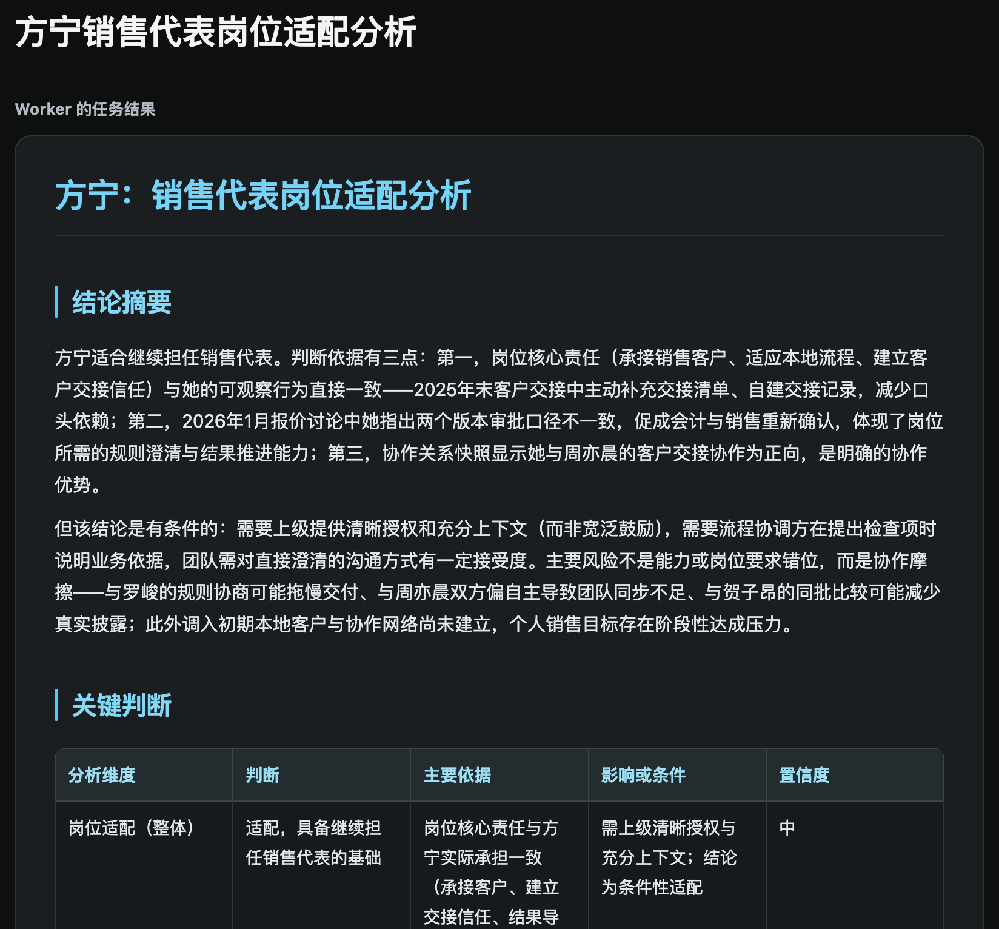

# OrgSight

#### 多 Agent 组织分析洞察系统

OrgSight 面向组织管理者，解决团队扩张时组织复杂度上升引入的管理难题。OrgSight 构建基于组织上下文的版本化组织快照，并基于 AgentTeams 构建多智能体分析框架。管理者只需将组织分析任务交给 Manager 或对应的团队 Leader，由 Leader 拆解任务、委派专业 Worker，在授权范围内查看组织、人员与协作数据，最终生成包含结论、依据、风险、信息缺口和置信度的结构化报告或决策建议。管理者或员工也可与 OrgSight 进行日常交流，OrgSight 会主动沉淀有价值的信息作为建模依据或组织上下文。

该项目参加 GOAI Agent Infra 赛道（目前仅为 Demo）。

## 已验证能力

“人才与角色洞察”团队的三条 Worker 链路均已完成真实端到端验证：

- `person-profile-worker`：人物职业画像；
- `role-and-position-analysis-worker`：岗位适配分析；
- `team-role-ecology-worker`：团队角色生态分析。

三者均遵循同一交付闭环：

```text
管理页面
  -> talent-role-insight-lead
  -> 对应专业 Worker
  -> OrgSight MCP
  -> PostgreSQL 合成组织数据
  -> result.md
  -> 已完成案例页面
```

每条链路均由 Leader 验收 Worker 写入的任务 `result.md`。Controller 只在任务状态为 `submitted` 且同目录存在真实 `result.md` 时，将案例提供给 8800 网页自动展示。人物画像、岗位适配和团队生态分别使用各自稳定的报告结构，并均包含依据、信息缺口和置信度。

仓库中还包含协作治理、业务运营和管理决策模拟等团队的 Agent 与 Skills 设计骨架。这些扩展团队尚未完成端到端验证。

## 演示副本：方宁销售代表岗位适配分析

### 输入

> 请评估方宁是否适合继续担任销售代表，重点分析她的岗位适配情况、协作优势和主要风险。

### 输出

网页案例展示：



该目录是手工保留在仓库中的演示副本：[查看 result.md](examples/fangning-sales-fit/result.md)。网页运行时不读取 `examples/`，而是通过 Controller 的案例接口自动读取 Team 共享任务存储中的真实 `result.md`。

## 演示数据

当前 Demo 使用的模拟组织基线：

- 22 名合成人员；
- 6 个正式组织单元；
- 正式岗位和汇报关系；
- 人物事实档案与人物职业模型。

结构化 fixture 位于 `fixtures/demo-office/`。人物模型通过初始化脚本写入 PostgreSQL，并生成可读的 Markdown 文档至 `data/model-documents/`。

## 项目结构

```text
agent-specs/              Agent、Team 和 AgentTeams package 定义
contracts/                数据与输出契约
data/model-documents/     生成后的人物模型 Markdown
fixtures/demo-office/     合成组织、人物和关系数据
migrations/               PostgreSQL 数据库结构
scripts/                  数据导入与模型文档生成脚本
skills/                   OrgSight 领域 Skills 与参考资料
src/orgsight/             MCP、授权、数据访问和管理页面
tests/                    自动化测试
```

## 与 AgentTeams 的关系

- 本仓库负责业务数据、Agent/Skills 定义、只读 MCP、授权逻辑和展示页面；
- [AgentTeams](https://github.com/DDDeeeee/AgentTeams) fork 负责 Manager、Team Leader、Worker、Task、Room、Matrix 通信和运行生命周期。

运行完整 Demo 时，需要单独部署对应版本的 AgentTeams，并安装 `agent-specs/packages/` 中的 Agent package。

## 环境要求

- Python 3.11+
- PostgreSQL
- Docker
- AgentTeams embedded runtime
- 支持 OpenAI 兼容接口的模型服务

## 本地初始化

创建虚拟环境并安装依赖：

```bash
python3 -m venv .venv
.venv/bin/pip install -e '.[dev]'
```

复制环境变量模板：

```bash
cp .env.example .env
```

初始化独立 Demo 数据库：

```bash
createdb orgsight_demo
psql postgresql://localhost/orgsight_demo --set ON_ERROR_STOP=1 --file migrations/versions/0001_demo_organization.sql
psql postgresql://localhost/orgsight_demo --set ON_ERROR_STOP=1 --file migrations/versions/0002_skill_result_storage.sql
psql postgresql://localhost/orgsight_demo --set ON_ERROR_STOP=1 --file migrations/versions/0003_mcp_task_authorization.sql
psql postgresql://localhost/orgsight_demo --set ON_ERROR_STOP=1 --file migrations/versions/0004_rename_task_objective.sql
.venv/bin/python scripts/seed_demo_data.py
.venv/bin/python scripts/generate_model_documents.py
```

启动只读 MCP 服务：

```bash
.venv/bin/orgsight-mcp
```

默认监听：

```text
http://127.0.0.1:8787/mcp
```

AgentTeams Worker 在 Docker 内可通过配置的宿主机地址访问该服务。

启动管理页面：

```bash
.venv/bin/orgsight-web
```

浏览器访问：

```text
http://127.0.0.1:8800
```

## 测试

```bash
.venv/bin/python -m pytest -q
```

## 治理、可观测与云端演进

OrgSight 以 AgentTeams 的 Team、Task、Room 机制作为多 Agent 协同基点。当前 Demo 已验证人才与角色洞察 Team 的人物职业画像、岗位适配和团队角色生态三条端到端链路：Leader 编排、Worker 委派、受控数据读取、`result.md` 提交、Leader 验收及网页案例展示。对于涉及高风险组织决策的后续场景，将补充人工确认、审批、回滚和审计边界。

运行侧将复用 AgentTeams 已有的任务与运行状态，并建设面向 OrgSight 的可视化观测看板，聚合任务 Trace、Agent 调用链路、模型 Token 消耗、工具调用、失败原因和结果质量信号，用于问题定位、成本治理与运行审计。

## Skill 工程与开放复用

项目包含岗位与角色分析、人物建模、协作关系建模、团队角色生态、团队健康、协作结构诊断、项目风险、情景模拟和干预设计等领域 Skills。每个 Skill 保持独立职责、输入输出约束、参考资料与依赖数据边界，可按 Agent 职责挂载，并在相近组织管理场景中复用。后续将补充 Skill 的版本发布、评估样例、质量回归和回滚机制。

本仓库以 [Apache-2.0](LICENSE) 协议开源，公开合成演示数据、Agent 与 Team 定义、Skills、MCP 契约、数据库初始化脚本、测试样例和完整结果示例，便于复现和二次开发。运行依赖与版本范围以 [pyproject.toml](pyproject.toml) 为准：Python 3.11+、MCP、PostgreSQL 驱动、Uvicorn 与 python-dotenv；AgentTeams 作为独立运行时仓库使用，遵循其自身许可证和依赖约束。如有云端部署、托管和运行保障需求，OrgSight 将优先采用阿里云云服务与官方用云 Skills 承接部署、可观测和通用工程能力；领域分析能力仍由 OrgSight 自身 Skills 与 AgentTeams 协同链路负责。
